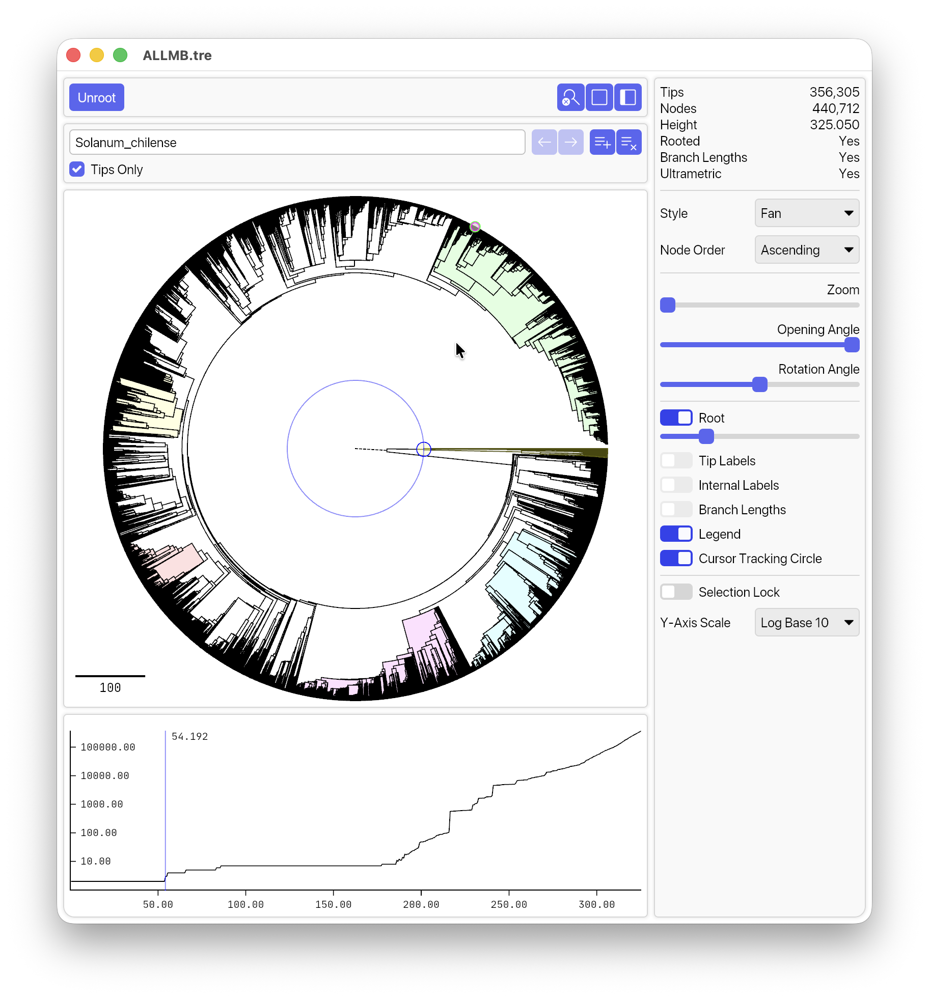
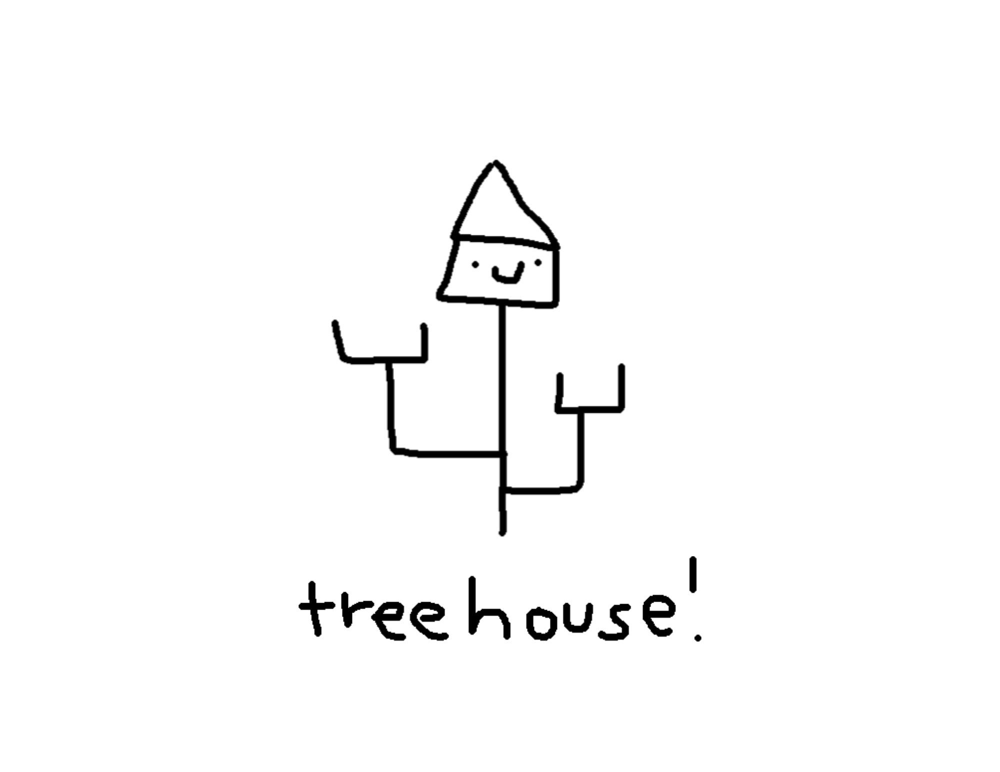

# TreeHouse
Welcome to TreeHouse!
<!-- View and edit gene trees and phylogenies -->

## What TreeHouse does
TreeHouse is an **extremely** fast tree viewer built for visualizing and exporting large phylogenetic trees. 
TreeHouse is built in Rust and aims to make tree-based research smoother and more user-friendly. 

## Which operating systems can run TreeHouse?
TreeHouse is currently supported for MacOS.

## How to get started with TreeHouse

The easiest way to install TreeHouse is to [download the latest release](releases) and follow the instructions for installation. 
Then, open a tree file of your choice ([examples available here](tree/main/tests/data)).
 <!-- and explore [the TreeHouse visualization options](wiki). -->

<!-- [Find detailed information on the TreeHouse Wiki here](wiki). -->

## Who maintains TreeHouse?

TreeHouse is developed and maintained by Dr. Karolis Ramanauskas ([kraman2@uic.edu](mailto:kraman2@uic.edu)) at the University of Illinois at Chicago.

## How do I get help with TreeHouse? How do I request a feature?

The best way to get help or request a feature is by posting an issue on the [github issues page](issues). 

